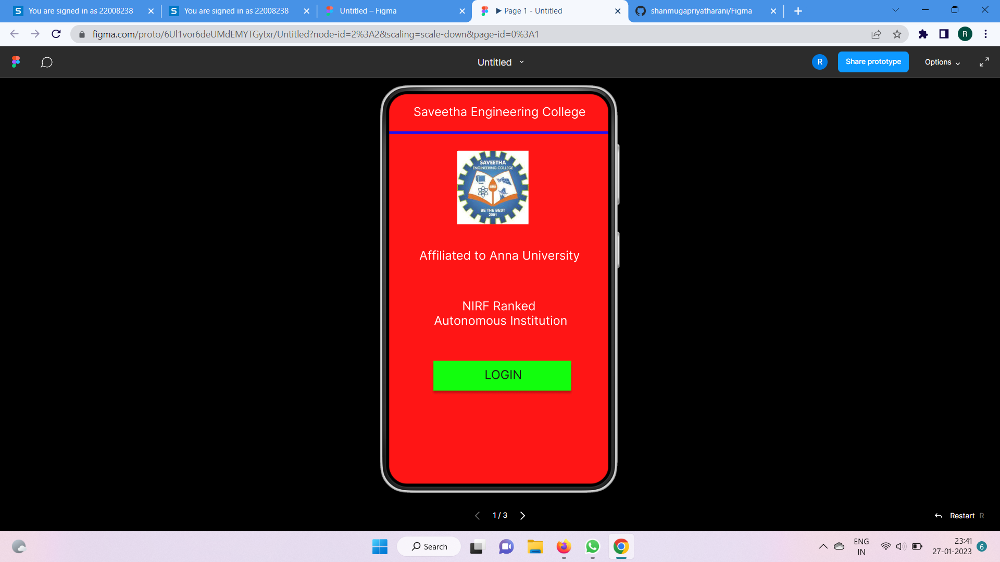
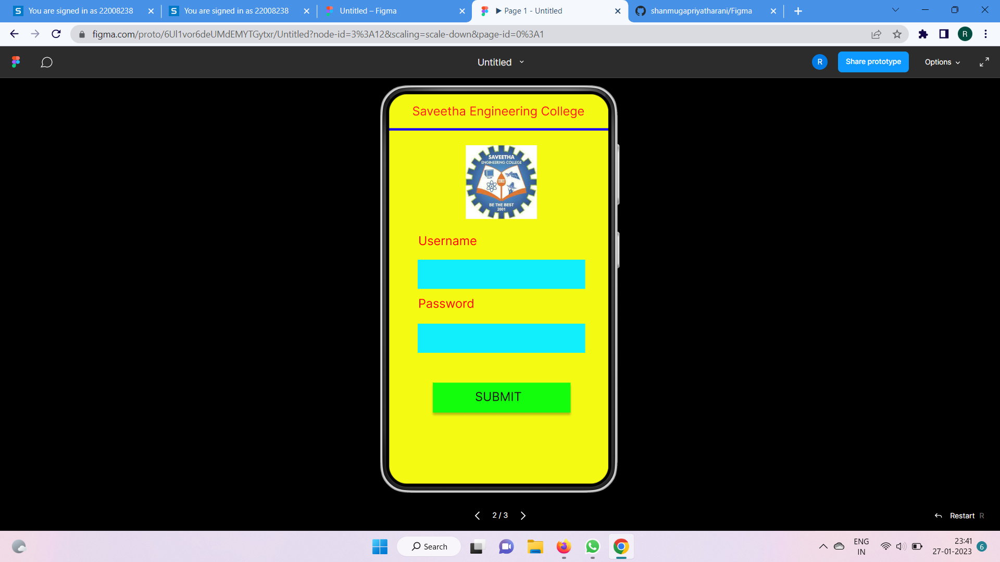
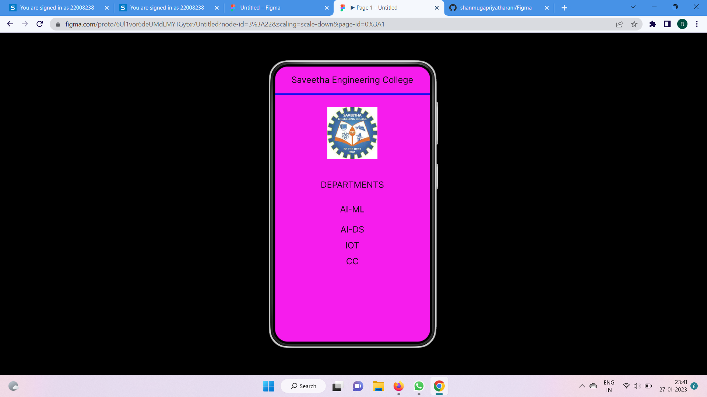

# Event Registration Web Application

## AIM:
To design, develop and deploy a web application for event registration.

## DESIGN STEPS:

### Step 1:
Create a new frame.

### Step 2:
Select any one preset size of your choice.

### Step 3:
Select the shapes you need.

### Step 4:
Import images as needed.

### Step 5:
Create pages based on your need and link them.

### Step 6:

Validate the HTML and CSS code.

### Step 6:

Publish the website in the given URL.

## DESIGN TOOL:
Figma

## code:
```
/* Home Page */
position: relative;
width: 360px;
height: 640px;
background: #FF1515;

/* Login Page */
position: relative;
width: 360px;
height: 640px;
background: #F5FA12;

/* Saveetha Engineering College */
position: absolute;
width: 325px;
height: 37px;
left: 17px;
top: 19px;
font-family: 'Inter';
font-style: normal;
font-weight: 400;
font-size: 20px;
line-height: 24px;
text-align: center;
color: #111010;

/* Saveetha Engineering College */
position: absolute;
width: 325px;
height: 37px;
left: 17px;
top: 19px;
font-family: 'Inter';
font-style: normal;
font-weight: 400;
font-size: 20px;
line-height: 24px;
text-align: center;
color: #111010;

/* DEPARTMENTS */
position: absolute;
width: 325px;
height: 37px;
left: 17px;
top: 263px;
font-family: 'Inter';
font-style: normal;
font-weight: 400;
font-size: 20px;
line-height: 24px;
text-align: center;
color: #111010;

/* AI-ML */
position: absolute;
width: 325px;
height: 37px;
left: 17px;
top: 320px;
font-family: 'Inter';
font-style: normal;
font-weight: 400;
font-size: 20px;
line-height: 24px;
text-align: center;
color: #111010;

/* AI-DS */
position: absolute;
width: 325px;
height: 37px;
left: 17px;
top: 367px;
font-family: 'Inter';
font-style: normal;
font-weight: 400;
font-size: 20px;
line-height: 24px;
text-align: center;
color: #111010;

/* IOT */
position: absolute;
width: 325px;
height: 37px;
left: 17px;
top: 404px;
font-family: 'Inter';
font-style: normal;
font-weight: 400;
font-size: 20px;
line-height: 24px;
text-align: center;
color: #111010;

/* CC */
position: absolute;
width: 325px;
height: 37px;
left: 17px;
top: 441px;
font-family: 'Inter';
font-style: normal;
font-weight: 400;
font-size: 20px;
line-height: 24px;
text-align: center;
color: #111010;

/* Line 3 */
position: absolute;
width: 360px;
height: 0px;
left: 0px;
top: 66px;
border: 4px solid #210FF0;

/* logo 3 */
position: absolute;
width: 117px;
height: 121px;
left: 121px;
top: 94px;
background: url(logo.jpg);
```
## OUTPUT:




## RESULT:
The program to design, develop and deploy a web application for event registration is completed successfully.